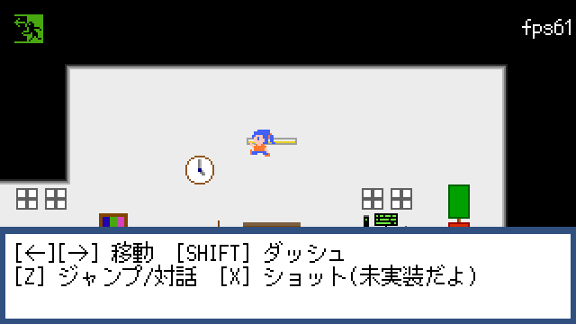

Wyte Engine
===============

[日本語](README-ja.md) ・ English

Wyte Engine is a 2D horizontal-scrolling action-adventure game assets for Unity3D.

Features
==========
- 2D Platform Jump Action
- Map Management
- Audio Management
- Sprite Management
- Flag / Item Management
- Lightweight Camera Controller
- Save / Load Feature
- Event Scripting System (Powered by Novel Script)
- Very powerful scripting API for Novel
- C#-level Extension API
- Very Easy AI Construction API

To use
=========

**WARNING! This project is work in progress!**

- The folder named `Assets/Wyte` is all components of the Wyte Engine. Copy that folder into your unity projects.
- `Assets/Demo` is the demo project for the Wyte Engine. Please refer it to use.

I won't write more informations because this project is WIP.

Contributing
==============
No thanks yet. I'll write the contributing guideline ASAP.

LICENSE
==========
Under the MIT License. See [LICENSE](LICENSE).

<s>(But I don't think my code is useful for supporting your game...)</s>
